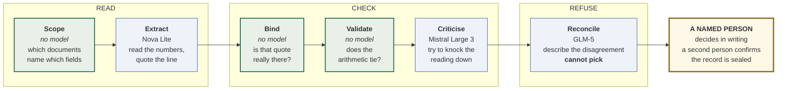

# KRISEVA ATTEST

### Read it. Check it. Refuse to guess.

**When the source documents for a regulatory filing disagree, this software refuses to pick a number.**
It shows every figure pinned to the exact line it came from, names why the sources disagree, and hands
the decision to a person who signs for it.

[**▶ Watch the 2 minute demo**](https://kriseva-gift-backup-2026.s3.us-east-1.amazonaws.com/video.html) ·
[**Open the live prototype**](https://kriseva-gift-backup-2026.s3.us-east-1.amazonaws.com/prototype/index.html) ·
[**Submission hub**](https://kriseva-gift-backup-2026.s3.us-east-1.amazonaws.com/index.html)

`24/24` planted failures caught · `0` silent picks · `<8s` per case · `20 of 40` steps with no model

*Kriseva AI Private Limited · GIFT IFIH Young Builders' Program 2026 · all data synthetic*

---

## The problem, in one paragraph

A fund management entity in GIFT IFSC files four numbers to its regulator every quarter, within 21
days of quarter end. Those numbers arrive from **five independent parties** who close their books at
different times: the administrator, the internal ledger, the subscription register, the custodian,
the valuer.

**So the numbers disagree, and nothing in any document says so.** The Compliance Officer and the
Principal Officer sign personally. Today the reasoning behind each filed number lives in an email
reply, and when the officer leaves it goes with them.

> A change of Compliance Officer is notified to IFSCA within **15 days**.
> The records must survive **8 years**.
> **The reasoning survives fifteen days.**

**Every system built for this picks a number.** On our demo case the ordinary rule, file what most
documents agree on, files **USD 17,800,000** for drawn capital. That is wrong. The correct figure is
19,300,000, and only a person who knows a capital call landed at 17:42 after a 16:00 cut-off can know
that. Nothing announces the error.

**A silent pick is the only failure in this product that nobody downstream can detect**, because
there is no disagreement left to find.

---

## How it works

**Green boxes contain no model.** They are string matching and arithmetic.

> **A model cannot check a model.** The three steps that decide whether a number survives are all
> plain code. The reader and the critic are forced onto **different companies**, verified when the
> system starts, so a model criticising its own reading is a startup failure and never a quiet one.

### Every role, measured on one real case of 40 steps

| Role | Steps | Model | Company | What it does |
|---|---|---|---|---|
| Orchestrator | 2 | **none** | | The plan and one wall-clock deadline for the whole run |
| **Scope** | 4 | **none** | | Matches each field name against each document's text |
| Extractor | 8 | `nova-lite` | Amazon | Reads candidate numbers and quotes the exact line |
| **Binder** | 7 | **none** | | Finds that quote in the source, or throws the number away |
| **Validator** | 7 | **none** | | Checks the accounting identities |
| Critic | 7 | `mistral-large-3` | Mistral | Attacks the reading, on an independent model family |
| Reconciler | 4 | `glm-5` | Z.ai | Names the disagreement. Forbidden in code from choosing |
| Narrator | 1 | `nova-lite` | Amazon | Writes the handoff to a named person |
| Learner | on a lesson | **none** | | Records what went wrong, for a human to approve as a rule |

**9 roles. 4 use a model. Of the 40 steps a case takes, exactly 20 contain no model at all** — and the
Trace screen counts that itself rather than being told.

We went from **7 model-backed roles to 4**, in two measured reductions. Nothing moved: 24 of 24
before and after, zero silent picks before and after, 299 tests green throughout.

---

## What is enforced in code, not asked for politely

This table is the product. Everything else is presentation.

| Rule | How |
|---|---|
| A quote not in the document does not count | The binder searches for it and drops the candidate. No model involved |
| The software may never choose between conflicting values | The reconciler's output is rejected if it contains a selected value or resolved state, at every depth |
| The critic may not share a model family with the extractor | Verified at startup. No independent route, **no boot** |
| Narrowing the work may never lose evidence | Scope is plain string matching. There is no model that could drop a field |
| A run may not exceed its budget | One deadline for the whole run; a step still running at it escalates to a person |
| The same person may not decide and confirm | Rejected at the sign-off endpoint |
| A field with no source may be attested, never decided | Separate endpoint, separate state, shown differently |

---

## What we measured

| | | Scope |
|---|---|---|
| **24 of 24** | Planted failure archetypes named with exactly the right cause | 10 archetypes, 24 cases, ground truth written by deterministic code **before any model saw the case** |
| **0 of 24** | Times the software chose a value by itself | The one that matters |
| **3.3–7.9s** | One complete nine-role case, 40 agent actions | Three consecutive live runs |
| **~14,700** | Tokens per case, recorded per action | **No dollar figure** — our account has no pricing API access |
| **299 / 24 / 9** | Unit tests, canon conformance, filing history | All green, re-run after every change |
| **182** | Screens swept on the deployed build | All 26 cases, zero raw machine words, zero empty screens |
| **90.1** | Predicted against the published rubric | A model's prediction, not a jury's verdict |

**The honest limit: we wrote those conflicts.** It is a consistency check across ten failure shapes,
not an accuracy claim about real documents.

### The result that went against us, published anyway

We predicted a frontier model with a good prompt could not do this. **We ran it, and it could.** Three
frontier models, each told to answer `UNCERTAIN` on disagreement, all abstained correctly on every
conflicted field with zero silent picks.

One column separated them: **evidence localisation**, where one model could not produce a single
quote that actually appeared in the source document. We publish that table rather than the one we
hoped for. [Full detail](docs/MEASURED_RESULTS.md).

---

## What is **not** built

- **Per-field regulatory rule mapping.** Stated as absent on screen. We will not invent a citation.
- **A local open-weight model on the offline path.** The provider interface exists; the wiring does not.
- **Any contact with real data.** We have never seen a real quarterly return.
- **A dollar cost.** The token count is the honest number.

**Nine defects** were found by using the product rather than reading it, all of which survived 299
passing tests. [All nine are published](docs/DEFECT_LEDGER_2026-08-19.md).

---

## The ask

Six things. **Five of them are not money.**

| | |
|---|---|
| **12** | introductions to fund management entities, of the 217 registered |
| **20** | quarter-sets of real redacted documents, 5 entities × 4 quarters |
| **20 hrs** | with the Compliance and Principal Officers who sign |
| **2 hrs** | with IFSCA supervision, on which rule requires which field |
| **18** | people across 8 roles to sit near, to find the second problem |
| **$2,500** | AWS credits, estimated and itemised from measured token counts |

By 30 October: a published base-rate study, extraction accuracy on real formats, the rule mapping
shipped, six officers having each completed a real field, **two signed pilots**, and a written answer
on whether there is a second problem here worth building.

[**The full ask, with dates and commitments**](docs/RESIDENCY_ASK.md)

---

## NOTICE, on what was built when

The program brief states: *"No pre-built repositories allowed. Code must start clean at 2:00 PM on
Friday, 21 August. Git commit histories will be audited."*

- **This repository contains no application source code.** Documents, results, pitch and deck only.
- **The linked prototype is a pre-event rehearsal build.** Deleted before travel; none of its code
  enters the sprint repository.
- **What we carry in is documents only**, and all of it is published here **before** the sprint, in
  [AGENT_CONTRACT_PACK.md](docs/AGENT_CONTRACT_PACK.md). **Nothing we carry is unpublished.**
- **The sprint repository starts empty at 14:00 on Friday 21 August** and is built live.

> An evidence-integrity company cannot win by gaming an audit.

---

## Everything in this repository

| Read this | If you want |
|---|---|
| [ARCHITECTURE_SIMPLE.md](docs/ARCHITECTURE_SIMPLE.md) | The whole system in one page, with 10, 30 and 60 second versions |
| [PRODUCT_AND_WORKFLOW.md](docs/PRODUCT_AND_WORKFLOW.md) | Product, workflow, every role, and how they run in order |
| [MASTER_QA_BANK.md](docs/MASTER_QA_BANK.md) | 87 questions with answers short enough to say out loud |
| [MAHEK_BUYER_BRIEF.md](docs/MAHEK_BUYER_BRIEF.md) | The buyer's point of view, in one read |
| [RESIDENCY_ASK.md](docs/RESIDENCY_ASK.md) | The six asks, in exact numbers |
| [MEASURED_RESULTS.md](docs/MEASURED_RESULTS.md) | Every number, its method, and what it does not prove |
| [DEFECT_LEDGER_2026-08-19.md](docs/DEFECT_LEDGER_2026-08-19.md) | Nine defects found by use, and the rule each produced |
| [SCENARIO_DESIGN.md](docs/SCENARIO_DESIGN.md) | The ten failure archetypes and the driver behind each |
| [CANON.md](docs/CANON.md) | The fictional world: every entity, document and number |
| [VOICE_STACK.md](docs/VOICE_STACK.md) | The TTS survey, what we run locally and what we rejected |
| [PITCH_3MIN.md](docs/PITCH_3MIN.md) · [PITCH_1MIN.md](docs/PITCH_1MIN.md) | The pitches, written to be spoken |
| [deck/](deck/index.html) | Ten slides |

---

## Data statement

Every entity, scheme, person, document and figure in this repository and in the prototype is
**fictional**. 20 fictional entities, 26 cases, 115 source documents, 80 prior quarterly filings.
Every document carries `SYNTHETIC TEST DOCUMENT, NOT A REAL RECORD` above its figures, so a
screenshot cannot be mistaken for a real record out of context.

**No real fund, customer, investor, entity or personal data appears anywhere.**

---

**Ayush Tiwary and Mahek** · Kriseva AI Private Limited

*The product refuses to answer when it cannot prove the answer.
Everything we write holds itself to the same rule.*

